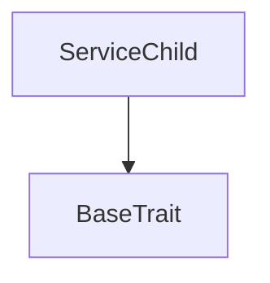

# TACT Compilation Report
Contract: ServiceChild
BOC Size: 923 bytes

# Types
Total Types: 19

## StateInit
TLB: `_ code:^cell data:^cell = StateInit`
Signature: `StateInit{code:^cell,data:^cell}`

## StdAddress
TLB: `_ workchain:int8 address:uint256 = StdAddress`
Signature: `StdAddress{workchain:int8,address:uint256}`

## VarAddress
TLB: `_ workchain:int32 address:^slice = VarAddress`
Signature: `VarAddress{workchain:int32,address:^slice}`

## Context
TLB: `_ bounced:bool sender:address value:int257 raw:^slice = Context`
Signature: `Context{bounced:bool,sender:address,value:int257,raw:^slice}`

## SendParameters
TLB: `_ bounce:bool to:address value:int257 mode:int257 body:Maybe ^cell code:Maybe ^cell data:Maybe ^cell = SendParameters`
Signature: `SendParameters{bounce:bool,to:address,value:int257,mode:int257,body:Maybe ^cell,code:Maybe ^cell,data:Maybe ^cell}`

## Deploy
TLB: `deploy#946a98b6 queryId:uint64 = Deploy`
Signature: `Deploy{queryId:uint64}`

## DeployOk
TLB: `deploy_ok#aff90f57 queryId:uint64 = DeployOk`
Signature: `DeployOk{queryId:uint64}`

## FactoryDeploy
TLB: `factory_deploy#6d0ff13b queryId:uint64 cashback:address = FactoryDeploy`
Signature: `FactoryDeploy{queryId:uint64,cashback:address}`

## ChangeOwner
TLB: `change_owner#819dbe99 queryId:uint64 newOwner:address = ChangeOwner`
Signature: `ChangeOwner{queryId:uint64,newOwner:address}`

## ChangeOwnerOk
TLB: `change_owner_ok#327b2b4a queryId:uint64 newOwner:address = ChangeOwnerOk`
Signature: `ChangeOwnerOk{queryId:uint64,newOwner:address}`

## NewService
TLB: `new_service#341deb08 description:^string = NewService`
Signature: `NewService{description:^string}`

## NewServiceResponse
TLB: `new_service_response#c785ee6f serviceId:uint256 = NewServiceResponse`
Signature: `NewServiceResponse{serviceId:uint256}`

## FinalizeService
TLB: `finalize_service#1758483f serviceId:uint256 = FinalizeService`
Signature: `FinalizeService{serviceId:uint256}`

## BiddingPlatform$Data
TLB: `null`
Signature: `null`

## InternalSetDescription
TLB: `internal_set_description#644145db description:^string = InternalSetDescription`
Signature: `InternalSetDescription{description:^string}`

## PlaceBid
TLB: `place_bid#b0c5e798 bidAmount:uint256 = PlaceBid`
Signature: `PlaceBid{bidAmount:uint256}`

## FinalizeBidding
TLB: `finalize_bidding#51f1bb80 excess:address = FinalizeBidding`
Signature: `FinalizeBidding{excess:address}`

## BidDetails
TLB: `_ bidder:Maybe address bidAmount:uint256 = BidDetails`
Signature: `BidDetails{bidder:Maybe address,bidAmount:uint256}`

## ServiceChild$Data
TLB: `null`
Signature: `null`

# Get Methods
Total Get Methods: 2

## highestBidDetails

## serviceInfo

# Error Codes
2: Stack underflow
3: Stack overflow
4: Integer overflow
5: Integer out of expected range
6: Invalid opcode
7: Type check error
8: Cell overflow
9: Cell underflow
10: Dictionary error
11: 'Unknown' error
12: Fatal error
13: Out of gas error
14: Virtualization error
32: Action list is invalid
33: Action list is too long
34: Action is invalid or not supported
35: Invalid source address in outbound message
36: Invalid destination address in outbound message
37: Not enough TON
38: Not enough extra-currencies
39: Outbound message does not fit into a cell after rewriting
40: Cannot process a message
41: Library reference is null
42: Library change action error
43: Exceeded maximum number of cells in the library or the maximum depth of the Merkle tree
50: Account state size exceeded limits
128: Null reference exception
129: Invalid serialization prefix
130: Invalid incoming message
131: Constraints error
132: Access denied
133: Contract stopped
134: Invalid argument
135: Code of a contract was not found
136: Invalid address
137: Masterchain support is not enabled for this contract
17448: Service does not exist
21277: Already finalized
41606: Bid must be higher than current highest
54404: Parent only
57085: Bidding is finalized
58383: Insufficient funds sent

# Trait Inheritance Diagram

# Contract Dependency Diagram

